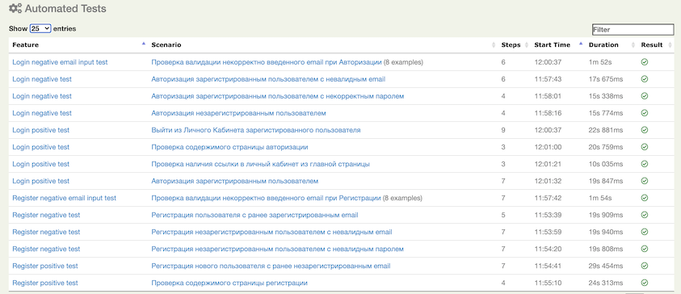

## Тестовый фреймворк для сайта ЦУМ
###### Stack: Java + Gradle + JUnit + Serenity BDD Framework.

В данном решении в качестве тестов используются сценарии:
- **Авторизация** в Личный Кабинет (_позитивные_):
    - Проверка наличия ссылки в личный кабинет из главной страницы
    - Проверка содержимого страницы авторизации
    - Авторизация зарегистрированным пользователем
    - Выйти из Личного Кабинета зарегистированного пользователя
- **Авторизация** в Личный Кабинет (_негативные_):
    - Авторизация незарегистрированным пользователем
    - Авторизация зарегистрированным пользователем с некорректным паролем
    - Авторизация зарегистрированным пользователем с невалидным email
    - Проверка валидации некорректно введенного email при Авторизации
- **Регистрация** нового пользователя (_позитивные_):
    - Проверка содержимого страницы регистрации
    - Регистрация нового пользователя с ранее незарегистрированным email
- **Регистрация** нового пользователя (_негативные_):
    - Регистрация пользователя с ранее зарегистрированным email
    - Регистрация незарегистрированным пользователем с невалидным email
    - Регистрация незарегистрированным пользователем с невалидным паролем
    - Проверка валидации некорректно введенного email при Регистрации

При написании тестов используется фреймворк **JUnit**. На данный момент тесты написаны без использования **BDD** подхода. 
В качестве возможной задачи по улучшению в будущем можно добавить реализацию тестовых сценариев, используя BDD. 

В качестве системы отчетности используется стандартный механизм **Serenity Aggregate Reports**. 

В итоговом отчете попадают тесты, организованные в Feature, которые именуются по названию классов, содержащих тесты. 
Названия тестов также имеют понятные имена, благодаря аннотациям @Title.

Для наглядности и упрощения разбора возможных инцидентов, в описание шагов тестовых действий добавлены уточняющие детали.

Также в отчете присутствует наглядное представление результатов Date-Driven тестов (тестов с параметрами).
 

